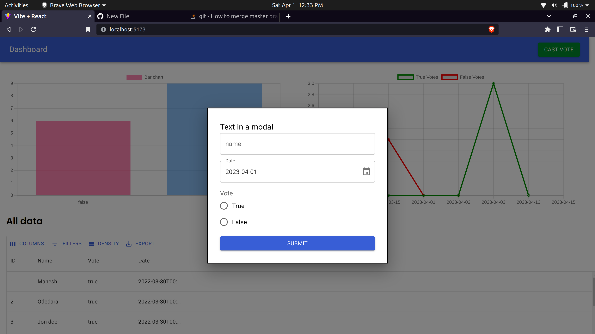
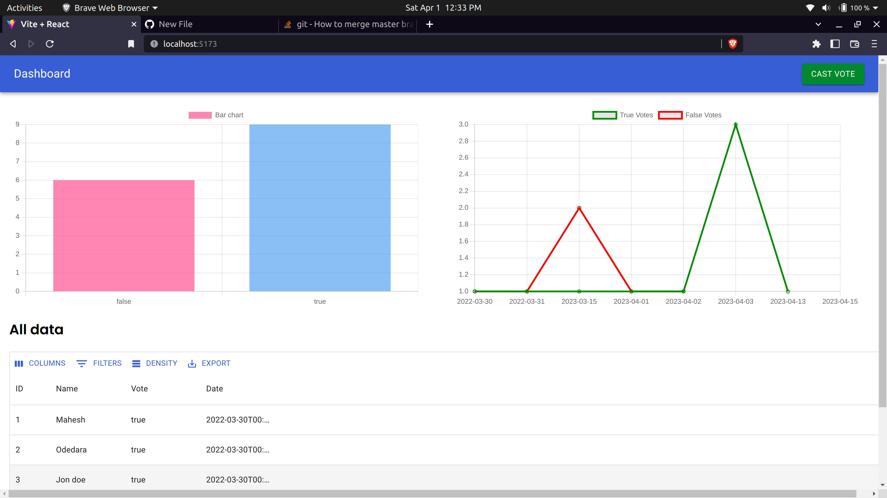

# A basic polling system and trend analysis

## Project Setup

Follow the steps below to get started with running the project locally

## Preqquiisites

Before you begin, ensure that you have installed the follwoing on your local machine : 

- Node.js(v16.15.1)
- npm or yarn package manager
- PostgresSQL

## Installation

1. Clone the repository to your local machine.
2. Navigate ot the project directory and install the dependencies for the server by running  `npm install` in the `server` folder
3. Set up the database by running the following command in the `server`
```bash
npx prisma migrate dev
```
This will apply the migrations to the database

4. Start the server by running `npm run dev` in the `server` folder. The server will start running on  `http://localhost:5000`.
5. Navigate to the `client` folder and install the dependencies by running `npm install`
6. Start the client by running `npm run dev` in the `client` folder. The client will start running on `http://localhost:5173`

That's it! for the setup. You should be able to access the client at `http://localhost:5173` and server at `http://localhost:5000`

## Folder Structure and Tech Stack

The project has the following folder structure: 

- `client` : contains the frontend code built with React (created using Vite).
- `server`: contains the backend code built with Express.js and Prisma

The project has uses the following technolgoies

### Frontend

- [React](https://react.dev)
- [Material UI](https://mui.com/)
- [ChartJs](https://www.chartjs.org/)
- [Formik](https://formik.org/)
- [Axios](https://axios-http.com/docs/intro)

### Backend

- [Express Js](https://expressjs.com/)
- [Prisma](https://www.prisma.io/)
- [PostgreSQL](https://www.postgresql.org/)

## Screenshots

### Screen : 1
A pop up modal with a form to accept user input



### Screen : 2
Dashboard which shows a bar chart, a line chart and a data grid to dispaly trend in polling choices



## Acknowledgements
List any resources, tutorials, or tools that I used to create this project

- [Chart JS Tutorial from  PedroTech](https://www.youtube.com/watch?v=RF57yDglDfE)
- [MUI Docs](https://mui.com/material-ui/getting-started/overview/)
- [Formik Docs](https://formik.org/docs/overview)
- [stackoverflow](https://stackoverflow.com)
- [chatGPT](https://chat.openai.com)

## Contact

### Mahesh Odedara 
- Email: maheshodedara13@yahoo.com
- Twitter : [@ichmahesh](https://twitter.com/ichmahesh)


